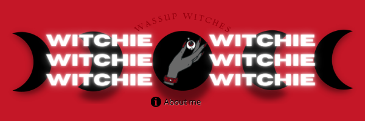

# My Portfolio Website

<!-- PROJECT LOGO -->
 

    

  <h3 align="center">Portfolio</h3>

  

    Get to know me and my projects :3
     
    <a href="http://www.witchie-me.xyz/"><strong> Webite »</strong></a>
     
     
    <a href="http://www.witcherybot.xyz/">Witchery Bot</a>    
  

<!-- ABOUT THE PROJECT -->
## About The Project

**Witchery:**
View my creations from Bots, Coding projects, Photography & Art. Get to know my work better and view Social Medias."

### Built With

* [JavaScript](https://www.javascript.com/)
* [css](https://www.w3schools.com/css/default.asp)
* Other stuff too bleh

<!-- CONTACT -->
## Contact

Witchery Wonders - [Email](witcherywonders.contact@gmail.com)

Website: [WitcheryBOT](http://www.witcherybot.xyz/)

Discord: `{~wi T chie~}#0001`

# ------

<!--Website Status -->
Website Status;

